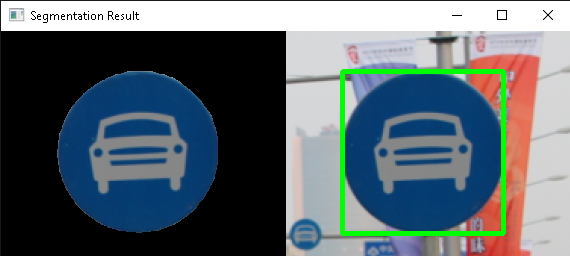

# Traffic Sign Detection and Recognition System
> This project emphasizes on the segmentation of traffic sign images based on the Chinese Traffic Sign Database (CTSD). The classification model is based on the SVM classifier trained with HOG and color features.
> Live demo [_here_](https://www.example.com). <!-- demo link -->

## Table of Contents
* [General Info](#general-information)
* [Libraries](#libraries)
* [Dataset](#dataset)
* [Screenshots](#screenshots)

## General Information
Source code for the whole project is available in the main.ipynb file, including the segmentation and classification model.
The color of traffic sign and category (0 - 57) would be classified based on the input image.
<!-- You don't have to answer all the questions - just the ones relevant to your project. -->

## Libraries
- OpenCV
- sklearn

## Dataset
- category_sample: sample sign images of the 58 categories based on the CTSD dataset
- sign: 70 test images to evaluate the classification model
- demo_set: the 70 test images from the sign folder + 20 sign images retrieved online
- tsrd_train: 4170 sign images to train the classifier
- tsrd_test: 1994 sign images to test the classifier

## Screenshots

